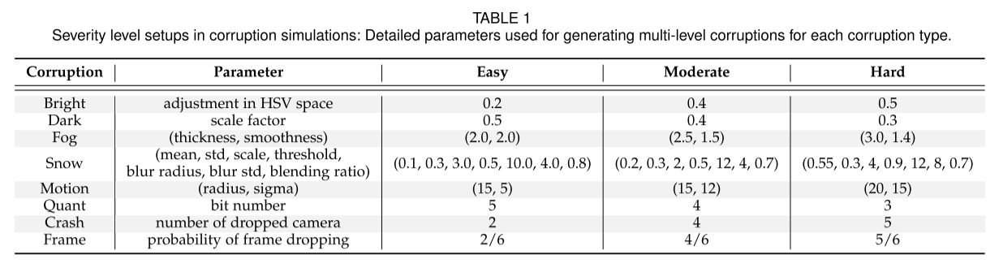

# 恶劣天气下的 3D 目标检测论文

## （综述1）论文题目：Object Detection in Autonomous Vehicles under Adverse Weather: A Review of Traditional and Deep Learning Approaches1
--------
### 发表日期：2024年2月26日
### 发表期刊/会议：《Algorithms》
### DOI
### 作者团队/机构：
### 开源代码链接：

### 针对什么问题：
### 以前怎么做的：
### 本文解决方法：
### 实验（对比试验和消融实验）：
### 对我写恶劣天气下的3D目标检测论文有什么用：

## （）论文题目：Benchmarking and Improving Bird’s Eye View Perception Robustness in Autonomous Driving
--------
### 发表日期：2025年5月
### 发表期刊/会议：《IEEE TRANSACTIONS ON PATTERN ANALYSIS AND MACHINE INTELLIGENCE》（IEEE TPAMI）
### DOI10.1109/TPAMI.2025.3535960
### 作者团队/机构：
### 开源代码链接：https://github.com/Daniel-xsy/RoboBEV

### 针对什么问题：
现有的 BEV 模型在“干净”的标准数据集（如 nuScenes）上对于4大感知任务：3D目标检测、地图分割、深度估计、语义占用预测表现极好。但在现实世界中，遇见以下八种特殊情况，如何评估模型对于4大感知任务的鲁棒性：
| 类型               | 情况描述                          | 英文描述                     |
|--------------------|-----------------------------------|-----------------------------|
| 外部环境           | 亮度过高、过暗、雾、雪            | Bright, Dark, Fog, Snow     |
| 内部传感器故障     | 运动模糊、色彩量化/压缩失真        | Motion Blur, Color Quant    |
| 时间连续性故障（首创） | 相机死机（持续几帧丢失）、丢帧    | Camera Crash, Frame Lost    |
### 以前怎么做的：
### 本文解决方法：
0.Abstract
1.INTRODUCTION
2.RELATED WORKS
2.1基于相机的BEV感知
2.2基于LiDAR的3D感知
2.3 对抗攻击下的鲁棒性
2.4 自然损坏下的鲁棒性
2.5 使用CLIP的鲁棒性增强
3.BEV PERCEPTION PRELIMINARIES
概述了BEV感知算法的常用技术作为预备知识。
4.BENCHMARK DESIGN
4.1 数据集生成
通过向nuScenes验证集引入八种损坏，创建nuScenes-C数据集，每种损坏有三个严重级别(Easy,Moderate,Hard)，Parameter是用来生成损坏的参数。一张原始的验证集图像会生成24张损坏图像，总计生成866,736张图像。

4.2 自然损坏

图2的x轴是像素值范围 0–255，y轴是该像素值出现的数量，这里用了300张nuScenes图像。原始的图像像素分布很均匀，当添加八种损失后，像素的分布就变化了。这说明损失会导致原始数据变换进而影响BEV感知结果。但是并不是像素改变越大对BEV感知的结果影响越大。
5.BENCHMARK EXPERIMENTS
6.ANALYSIS AND DISCUSSION
7.CONCLUSION
### 实验（对比试验和消融实验）：

### 对我写恶劣天气下的3D目标检测论文有什么用：

